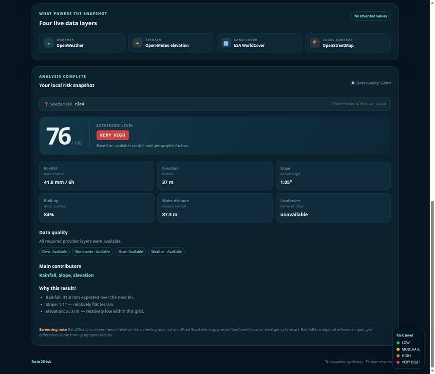

# Rain2Risk

## A simple flood-risk map

Rain2Risk is a small web app. It gives a quick flood-risk score for a place on the map.

The user clicks a place. The app gets weather and map data. It then shows a score from **0 to 100** and colors the map cells.

> **Important:** Rain2Risk is only a screening tool. It is not an official flood warning system. Do not use it for safety or emergency decisions.

## See the app

### Desktop


### Mobile


### Live result



## How it works

```text
Choose a place on the map
          ↓
Send the place to the API
          ↓
Get weather and map data
          ↓
Make a simple risk score
          ↓
Show the score and map cells
```


## Data used

| Source | What it gives |
|---|---|
| [OpenWeather](https://openweathermap.org/api) | Rain and weather forecast |
| [Open-Meteo](https://open-meteo.com/) | Height above sea level |
| [ESA WorldCover](https://esa-worldcover.org/) | Land cover data |
| [OpenStreetMap / Overpass](https://overpass-api.de/) | Buildings, water, and land use |

If a source is not available, the app says so. It does not make up data.

## Main parts

```text
backend/       Python server and risk code
frontend/      Map page, JavaScript, and CSS
data/          Small sample data files
docs/           Images, diagrams, and project notes
scripts/       Test and helper scripts
tests/         Offline tests
legacy/        Old code kept for reference
```

The live app uses the code in `backend/` and `frontend/`. The `legacy/` folder is not used by the live app.

## Run it on your computer

You need Python 3. You also need Node.js for one JavaScript check.

### 1. Download the project

```bash
git clone https://github.com/amkkoussay/rain2risk.git
cd rain2risk
```

### 2. Create a Python environment

```bash
python -m venv .venv
. .venv/bin/activate
pip install -r requirements.txt
```

### 3. Add your weather key

Copy `.env.example` to `.env` and add your OpenWeather key:

```dotenv
OPENWEATHER_API_KEY=your-key-here
APP_HOST=127.0.0.1
APP_PORT=8000
OPENWEATHER_TIMEOUT=10
WEATHER_CACHE_TTL=300
```

Never put a real key in GitHub.

### 4. Start the app

```bash
python backend/main.py
```

Open this address in your browser:

```text
http://127.0.0.1:8000/
```

## API

### Check the server

```text
GET /api/health
```

### Analyze a place

```text
POST /api/analyze
```

Example body:

```json
{"lat": 36.8065, "lon": 10.1815}
```

The answer includes the place, weather, map cells, risk score, data sources, and data quality.

## Test the project

Run all normal checks from the project folder:

```bash
python scripts/verify_project.py
```

This runs:

- Python compile check
- Offline Python tests
- JavaScript syntax check

The live test needs an OpenWeather key and network access:

```bash
python scripts/global_smoke_test.py
```

## Project notes and images

The `docs/` folder has the full project record:

- [Operations guide](docs/OPERATIONS.md)
- [Delivery notes](docs/DELIVERY.md)
- [Architecture diagram](docs/architecture-clean.png)
- [Analysis flow](docs/analysis-workflow.png)
- [Project roadmap](docs/project-roadmap.png)
- [All screen images](docs/screenshots/)
- [Data source notes](docs/global-data-sources.md)
- [Visual review](docs/visual-review.md)

## Limits

- The score is a simple estimate.
- It is not a water-depth model.
- It is not a flood warning.
- Rain data comes from a forecast for the chosen place. It is not measured for every map cell.
- Results can change when a data source is slow, missing, or has low coverage.

## License

No license file has been added yet. Please add a license before using this code in a larger project.
