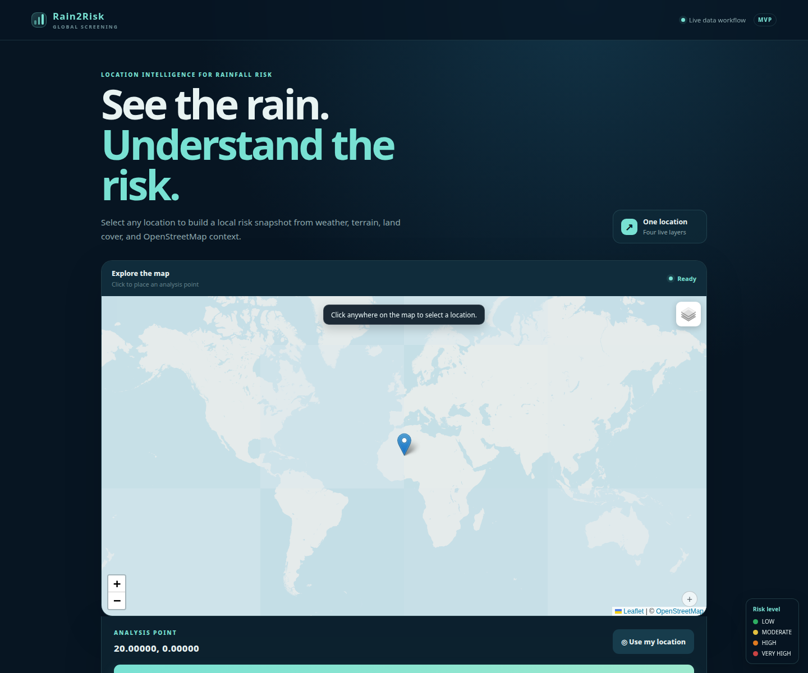
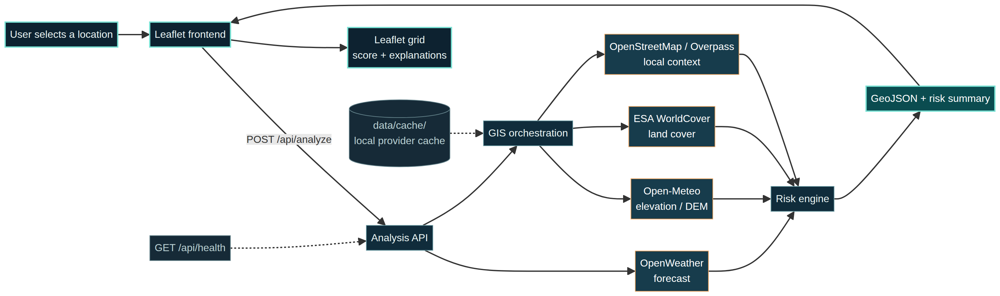

# Rain2Risk

## What is it?

Rain2Risk is a small web app for quick flood-risk checks.

Choose a place on the map. The app gets rain, height, land, and water data. It then gives a simple score from **0 to 100** and colors the map cells.

## Why this project?

I built Rain2Risk to learn how to join live data from many sources into one clear result. It is an **applied data engineering project**: it has an API, live data calls, map data, a simple risk model, tests, and proof files.

The goal is not to give a perfect flood forecast. The goal is to show a clear and honest data flow from raw data to a useful map.

> **Important:** Rain2Risk is only a screening tool. It is not an official flood warning system. Do not use it for safety or emergency decisions.

## How does it work?

```text
Choose a place on the map
          ↓
Send the place to the API
          ↓
Get weather and map data
          ↓
Make a simple risk score
          ↓
Show the score and map cells
```

Main data sources:

- [OpenWeather](https://openweathermap.org/api) for rain and weather.
- [Open-Meteo](https://open-meteo.com/) for height above sea level.
- [ESA WorldCover](https://esa-worldcover.org/) for land cover.
- [OpenStreetMap / Overpass](https://overpass-api.de/) for buildings, water, and land use.

If a source is not available, the app says so. It does not make up data.

## Live demo

The project has a local browser demo. These images show the real interface:



- [Mobile screen](docs/screenshots/rain2risk-mobile.png)
- [Live Tokyo result](docs/screenshots/live-tokyo-result.webp)

## Architecture



The full flow is in the [analysis flow diagram](docs/analysis-workflow.png). The editable Mermaid files are in `docs/`.

Main parts:

```text
backend/       Python server and risk code
frontend/      Map page, JavaScript, and CSS
data/          Small sample data files
docs/          Images, diagrams, proof, and notes
scripts/       Test and helper scripts
tests/         Offline tests
```

## Evidence: tested with real data

This was tested with live weather and map services. It is not only a local demo.

- **5 cities passed the live smoke test:** Tunis, Tokyo, New York, Dhaka, and Amsterdam.
- Each city returned **80 map cells**.
- Weather, height, land cover, and OpenStreetMap data were available in the recorded run.
- A separate browser run for Tokyo showed **41.8 mm of rain in 6 hours** and a **76/100** score.

| City | Result | Map cells | Data sources |
|---|---:|---:|---|
| Tunis | PASS | 80 | Weather, height, land cover, OSM |
| Tokyo | PASS | 80 | Weather, height, land cover, OSM |
| New York | PASS | 80 | Weather, height, land cover, OSM |
| Dhaka | PASS | 80 | Weather, height, land cover, OSM |
| Amsterdam | PASS | 80 | Weather, height, land cover, OSM |

Read the proof files:

- [Delivery notes and Tokyo live result](docs/DELIVERY.md)
- [Runtime proof](docs/runtime-proof.json)
- [Live smoke results for 5 cities](docs/global-smoke-results.jsonl)
- [Live smoke test script](scripts/global_smoke_test.py)
- [WorldCover data check](docs/worldcover-sanity-results.jsonl)

## Limitations

- The score is a simple estimate.
- It is not a water-depth model.
- It is not a flood warning.
- Rain data comes from a forecast for the chosen place. It is not measured for every map cell.
- Results can change when a data source is slow, missing, or has low coverage.
- The old event data has no exact point for each flood event, so the project does not claim an accuracy score from that data.

See the [validation report](docs/validation/validation_report.md), [validation metrics](docs/validation/metrics.json), and [source notes](docs/validation/source_notes.md).

## Run it on your computer

You need Python 3. You also need Node.js for one JavaScript check.

### 1. Download the project

```bash
git clone https://github.com/amkkoussay/rain2risk.git
cd rain2risk
```

### 2. Create a Python environment

```bash
python -m venv .venv
. .venv/bin/activate
pip install -r requirements.txt
```

### 3. Add your weather key

Copy `.env.example` to `.env` and add your OpenWeather key:

```dotenv
OPENWEATHER_API_KEY=your-key-here
APP_HOST=127.0.0.1
APP_PORT=8000
OPENWEATHER_TIMEOUT=10
WEATHER_CACHE_TTL=300
```

Never put a real key in GitHub.

### 4. Start the app

```bash
python backend/main.py
```

Open this address in your browser:

```text
http://127.0.0.1:8000/
```

## API

### Check the server

```text
GET /api/health
```

### Analyze a place

```text
POST /api/analyze
```

Example body:

```json
{"lat": 36.8065, "lon": 10.1815}
```

The answer includes the place, weather, map cells, risk score, data sources, and data quality.

## Tests

Run all normal checks from the project folder:

```bash
python scripts/verify_project.py
```

The current check has:

- Python compile check: **PASS**
- Offline Python tests: **19 tests, PASS**
- JavaScript syntax check: **PASS**

The live test needs an OpenWeather key and network access:

```bash
python scripts/global_smoke_test.py
```

The recorded live results are in [global-smoke-results.jsonl](docs/global-smoke-results.jsonl).

## Old code

The old prototype is not in the main branch. It is kept in the [legacy-archive branch](https://github.com/amkkoussay/rain2risk/tree/legacy-archive) so the main project stays easy to read.

The main branch contains the active app, its proof files, and the useful validation notes in `docs/validation/`.

## More project files

- [Operations guide](docs/OPERATIONS.md)
- [Delivery notes](docs/DELIVERY.md)
- [Runtime proof](docs/runtime-proof.json)
- [Project roadmap](docs/project-roadmap.png)
- [All screen images](docs/screenshots/)
- [Data source notes](docs/global-data-sources.md)
- [Visual review](docs/visual-review.md)

## License

This project is released under the [MIT License](LICENSE).

Copyright (c) 2026 Koussay Mehdouani.
