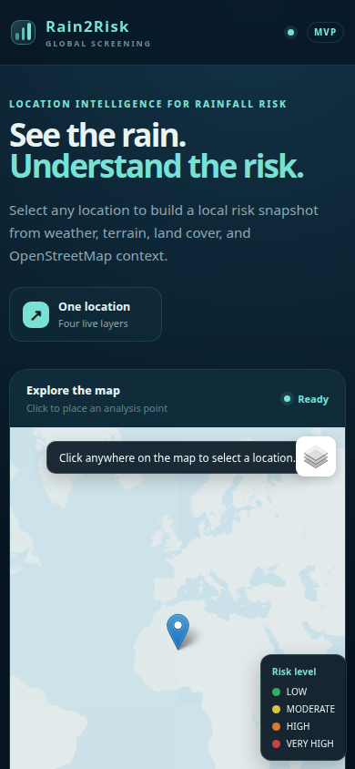

# Rain2Risk

**Live demo:** https://rain2risk-5naxo7otn-koussaymehdouani-4197s-projects.vercel.app/

Rain2Risk is a small web app. You pick a place on the map, and it shows a flood-risk score from 0 to 100 for that area.

## How it works

1. You click a place on the map.
2. The app gets data from 4 sources: rain forecast (OpenWeather), land height (Open-Meteo), land cover (ESA WorldCover), and map data (OpenStreetMap).
3. It mixes these into one risk score.
4. You see a colored grid on the map.




## What was broken and how I fixed it

### Bug 1: Every place showed 100/100 risk
**What broke:** The risk score was multiplied by 100 two times. So almost every place showed the maximum score, even with no rain.
**How I fixed it:** Now the app divides the weighted score by the total weight, one time only. A test checks that zero rain never gives a very-high score.

### Bug 2: Missing data looked like zero risk
**What broke:** When no data was available, the app showed 0 — as if the place was safe. That was wrong and dangerous.
**How I fixed it:** Now the app shows "UNAVAILABLE" instead of a number when there is no data.

### Bug 3: Bad coordinates were accepted
**What broke:** Broken numbers like NaN could pass the location check.
**How I fixed it:** The app now rejects any coordinate that is not a real, finite number.

### Bug 4: Wrong distance numbers
**What broke:** Distance was calculated with a simple flat-map formula. This is wrong because the Earth is round.
**How I fixed it:** Now the app uses the haversine formula (correct distance on a sphere).

### Bug 5: Two users could break the cache
**What broke:** When two people used the app at the same time, they could write to the same temporary file.
**How I fixed it:** Each write now uses its own temporary file name.

## Why this approach

- **Honest numbers:** When data is missing, the app says "unavailable". It never invents numbers.
- **Simple code:** The app uses only Python's standard library plus one small package. No Docker, no heavy tools.
- **Clear limits:** This is a screening tool, not an official flood warning. It does not use machine learning.

## How the data flows


## Try it yourself

```bash
pip install -r requirements.txt
python backend/main.py
```

You need a free OpenWeather key for rain data. Add it like this:

```bash
OPENWEATHER_API_KEY=your-key-here
```

Then open http://127.0.0.1:8000/ in your browser.

## API

- `POST /api/analyze` — send `{"lat": 36.8, "lon": 10.18}`, get back the risk score and the map grid.
- `GET /api/health` — check that the app is running.
